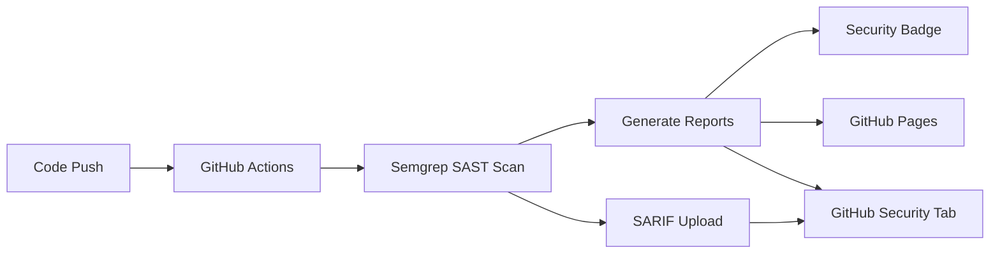

# 🔒 CI/CD Security Scanner

[](https://github.com/kiefertaylorland/cicd-security-scanner/actions/workflows/security-scan.yml)

Automated SAST (Static Application Security Testing) pipeline using Semgrep for continuous security monitoring.

## 🎯 What This Does

This project demonstrates a **complete CI/CD security scanning solution** that:

- ✅ **Automatically scans code** for security vulnerabilities on every push/PR
- 🛡️ **Uses Semgrep** for comprehensive SAST analysis
- 📊 **Generates security badges** showing vulnerability status
- 📈 **Creates HTML reports** hosted on GitHub Pages
- 🔍 **Integrates with GitHub Security** tab for detailed findings
- ⚡ **Runs fast** (typically < 2 minutes)

## 🚀 Quick Demo

1. **Check the Badge**: The security badge above shows current vulnerability status
2. **View Live Report**: [Security Dashboard](https://kiefertaylorland.github.io/cicd-security-scanner/security-reports/)
3. **See Action Logs**: Click the workflow badge to see detailed scan results


## 🏗️ Architecture



## 🔧 How to Use

### Option 1: Fork This Repository

1. Fork this repository
2. Update the badge URLs in README (replace `kiefertaylorland` with your username)
3. Enable GitHub Pages in repository settings
4. Push code changes to trigger scans

### Option 2: Add to Your Existing Project

1. Copy `.github/workflows/security-scan.yml` to your repository
2. Add the badge to your README:

   ```markdown
   [](https://kiefertaylorland.github.io/YOUR_REPO/security-reports/)
   ```

### Option 3: Local Testing

```bash
# Install Semgrep
pip install semgrep

# Run security scan locally
semgrep --config=auto --config=p/security-audit src/

# Generate JSON report
semgrep --config=auto --json --output=results.json src/
```

## 📊 What Gets Scanned

The pipeline scans for:

- 🔑 **Secrets & API Keys** - Hardcoded credentials, tokens
- 💉 **Injection Attacks** - SQL injection, command injection, XSS
- 🛡️ **OWASP Top 10** - Common web application vulnerabilities  
- 🔒 **Cryptography Issues** - Weak encryption, insecure random numbers
- 🌐 **Web Security** - CORS issues, insecure headers
- 📁 **File Security** - Path traversal, insecure file operations

## 🎨 Sample Vulnerabilities

This repository includes **intentionally vulnerable sample code** for demonstration:

### Python App (`src/app.py`)

- SQL Injection in user lookup
- Command injection in ping function
- Server-side template injection
- Path traversal in file reader
- Hardcoded API keys

### JavaScript App (`src/server.js`)

- Command execution vulnerabilities
- XSS in search functionality
- Weak cryptography usage
- Path traversal in file downloads

**⚠️ Note: These are intentional vulnerabilities for demo purposes only!**

## 📈 Security Reports

### Badge States

- 🟢 **Green**: No security issues found
- 🟡 **Yellow**: Low-risk issues only
- 🟠 **Orange**: Medium-risk issues found
- 🔴 **Red**: High-risk vulnerabilities detected

### Report Contents

- **Vulnerability counts** by severity level
- **Scan metadata** (timestamp, commit, rules used)
- **Direct links** to GitHub Security tab for details

## ⚙️ Configuration

### Required Secrets (Optional)

For enhanced Semgrep features, add these repository secrets:

- `SEMGREP_APP_TOKEN`: Your Semgrep App token for advanced rules
- `SEMGREP_DEPLOYMENT_ID`: Your Semgrep deployment ID

### Customizing Rules

Edit the `SEMGREP_RULES` section in the workflow to adjust scanning:

```yaml
env:
  SEMGREP_RULES: >-
    --config=auto
    --config=p/security-audit
    --config=p/secrets
    --config=p/owasp-top-ten
    --config=p/python          # Add language-specific rules
    --config=p/javascript       # Add more rule sets
```

### Scan Frequency

The pipeline runs on:

- ✅ Every push to `main` or `develop`
- ✅ Every pull request to `main`
- ✅ Daily at 2 AM UTC (scheduled)

## 🎯 Benefits

### For Development Teams

- **Early Detection**: Catch vulnerabilities before they reach production
- **Developer Education**: Learn about security issues through clear reports
- **Compliance**: Automated evidence for security audits

### For DevOps/Security Teams

- **Continuous Monitoring**: Always-on security scanning
- **Zero Configuration**: Works out of the box
- **Integration Ready**: Plugs into existing GitHub workflows

## 🔄 CI/CD Integration Examples

### Fail Build on High-Risk Issues

```yaml
- name: 🚫 Fail on High-Risk Vulnerabilities
  run: |
    if [ "$HIGH_VULNS" -gt "0" ]; then
      echo "❌ High-risk vulnerabilities found!"
      exit 1
    fi
```

### Slack Notifications

```yaml
- name: 📢 Notify Slack
  if: env.HIGH_VULNS > 0
  uses: 8398a7/action-slack@v3
  with:
    status: failure
    text: "🚨 Security scan found ${{ env.HIGH_VULNS }} high-risk vulnerabilities!"
```

## 📚 Learn More

- 📖 [Semgrep Documentation](https://semgrep.dev/docs/)
- 🛡️ [GitHub Security Features](https://docs.github.com/en/code-security)
- 🔍 [SAST Best Practices](https://owasp.org/www-community/Source_Code_Analysis_Tools)

## 🎉 Next Steps (Future Enhancements)

- [ ] **Add DAST scanning** with OWASP ZAP
- [ ] **Container scanning** with Trivy or Grype  
- [ ] **Dependency scanning** with Safety/npm audit
- [ ] **License compliance** checking
- [ ] **Infrastructure as Code** scanning with Checkov
- [ ] **Multi-language support** expansion
- [ ] **Custom rule development** for organization-specific needs
- [ ] **Integration with SIEM** systems
- [ ] **Automated fix suggestions** via PRs

## 📄 License

MIT License - feel free to use this in your projects!

---

**⭐ Star this repository if it helps secure your CI/CD pipeline!**
